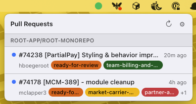
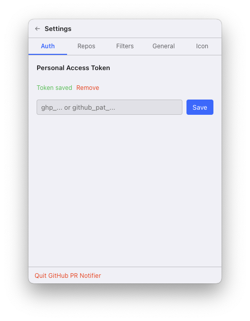
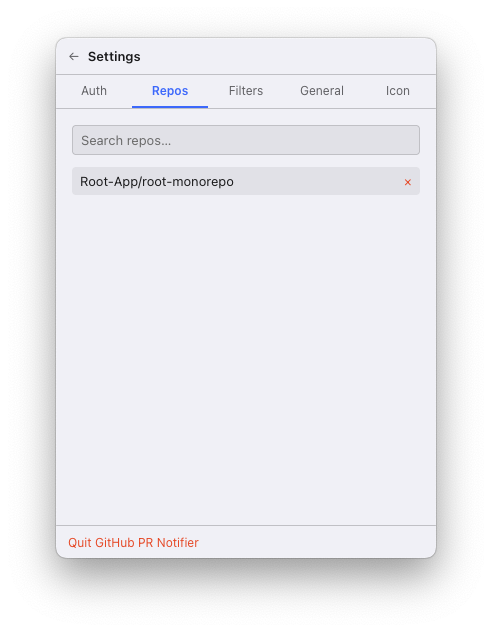
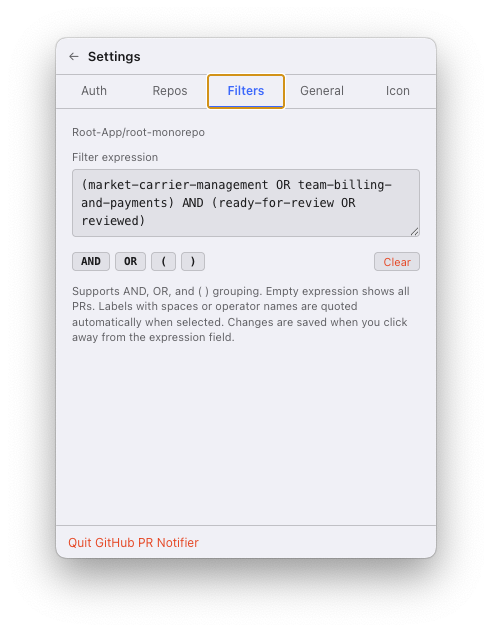
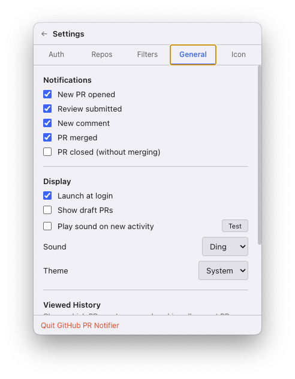
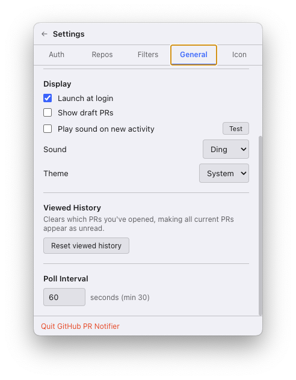
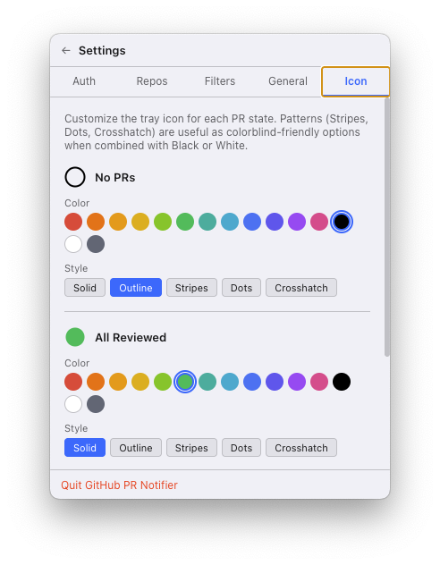

# GitHub PR Notifier

A macOS menu bar app that monitors GitHub pull requests and delivers native notifications for PR activity.

## Screenshots

### PR List
The tray popover shows open PRs grouped by repository. Each PR displays its number, title, author, age, and colored label chips. An unread indicator (blue dot) marks PRs you haven't opened yet.



### Auth
Paste a GitHub Personal Access Token (classic `ghp_…` or fine-grained `github_pat_…`). The token is stored encrypted via macOS `safeStorage` — never in plaintext.



### Repos
Search for repositories you have access to and add them to your watch list. Each watched repo gets its own filter expression.



### Filters
Write a boolean label-filter expression per repository. Use `AND`, `OR`, and `( )` grouping. As you type, a floating autocomplete dropdown surfaces matching labels from the repo — arrow keys navigate, Enter/Tab completes, Escape dismisses. Labels containing spaces or matching operator names are auto-quoted.



### General — Notifications & Display
Choose which events trigger native macOS notifications (new PR, review, comment, merge, close). Toggle draft PR visibility, launch at login, and audible chimes with a selectable sound. Theme follows System, Light, or Dark. Poll interval is configurable (minimum 30 s).




### Icon
Customize the tray icon independently for each PR state: **No PRs**, **All Reviewed**, and **Needs Review**. Pick any color from the palette and choose a fill style — Solid, Outline, Stripes, Dots, or Crosshatch. Patterns are useful as colorblind-friendly alternatives when combined with Black or White.



---

## Features

- Lives in the macOS menu bar — no Dock icon
- Monitors multiple repositories simultaneously
- Two-stage polling: lightweight `/notifications` heartbeat (configurable interval) + GraphQL detail fetch on change
- Boolean label-filter expressions per repo with inline autocomplete
- Native macOS notifications for: new PRs, reviews, comments, merges, and closes
- Audible notification chimes with selectable sounds
- Tracks which PRs you've viewed, with unread dot indicators
- Customizable tray icon color and fill style per PR state (with colorblind-friendly pattern options)
- Launch at login
- Dark/light/system theme support
- Distributable as a signed `.dmg`

## Requirements

- macOS 13 (Ventura) or later
- Node.js 18+
- A GitHub Personal Access Token (classic or fine-grained) with `repo` scope

## Setup

```bash
npm install
npm run dev
```

On first launch, go to **Settings → Auth**, paste your GitHub PAT, and click **Save**. Then add repositories to watch under **Settings → Repos**.

## Building a distributable DMG

```bash
npm run build:mac
```

The signed `.dmg` will be output to `build/`. To enable notarization, set the following environment variables before building:

```
APPLE_ID=your@apple.id
APPLE_APP_SPECIFIC_PASSWORD=xxxx-xxxx-xxxx-xxxx
APPLE_TEAM_ID=XXXXXXXXXX
```

## Token Storage

Your GitHub token is encrypted using macOS's built-in secure storage (`safeStorage`) and never stored in plaintext.

## License

MIT — see [LICENSE](LICENSE).
